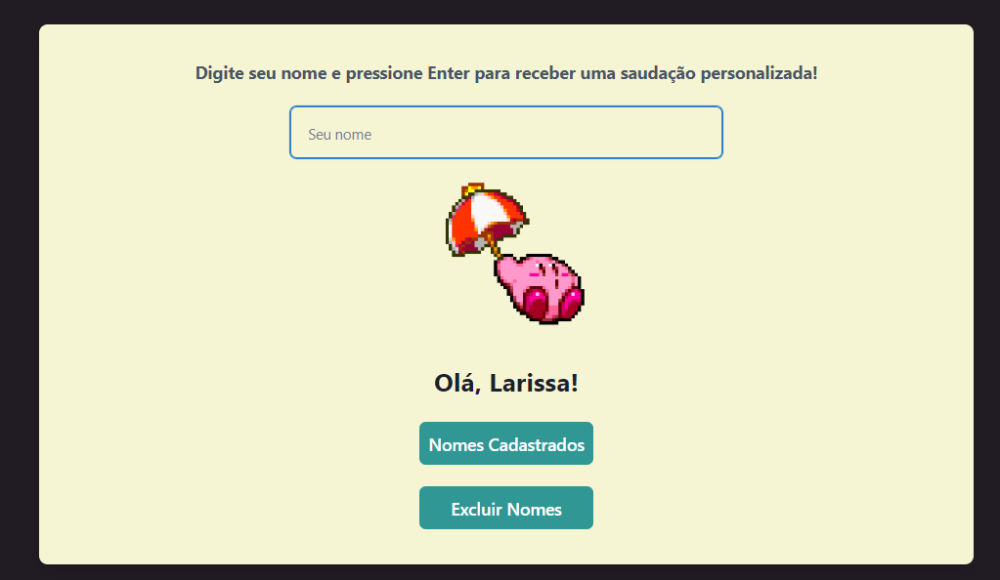

# 🚀 Projeto Fullstack - Gerador de Frases com Nomes  

Este é um projeto **Fullstack** desenvolvido com **Node.js + Express** no back-end e **React + Chakra UI** no front-end.  
Toda a aplicação roda em **containers Docker**, garantindo portabilidade e fácil execução.  



---

## 📌 Funcionalidades  

### Back-end (Node.js + Express + CORS + Nodemon)  
- **POST `/greet`** → Recebe um nome e retorna: 
```
Olá [Nome da Pessoa]
```
- **GET `/recent`** → Retorna os **10 primeiros nomes** cadastrados.  
- **DELETE `/clear`** → Remove **todos os nomes** cadastrados.  

### Front-end (React + Chakra UI)  
- Formulário para adicionar um nome.  
- Exibição da lista com os 10 primeiros nomes.  
- Botão para limpar todos os nomes.  
- Interface estilizada com **Chakra UI**.  

---

## 🛠 Tecnologias Utilizadas  

### Backend  
- Node.js  
- Express  
- CORS  
- Nodemon  

### Frontend  
- React  
- Chakra UI  

### Infraestrutura  
- Docker  
- Docker Compose  

---

## 📂 Estrutura do Projeto  

```bash
/Digite-Seu-Nome
│
├── backend
│ ├── package.json
│ ├── src/
│ └── ...
│
├── frontend
│ ├── package.json
│ ├── src/
│ └── ...
│
├── docker-compose.yml
└── README.md
```

## ▶️ Como Rodar o Projeto  

### 1. Clonar o repositório  
```bash
git clone https://github.com/LarissaCns/Digite-Seu-Nome.git
cd Digite-Seu-Nome
```

### 2. Subir os containers com Docker
```bash
docker-compose up --build
```

### 3. Acessar a aplicação
- Frontend: http://localhost:3000
- Backend (API): http://localhost:3001


